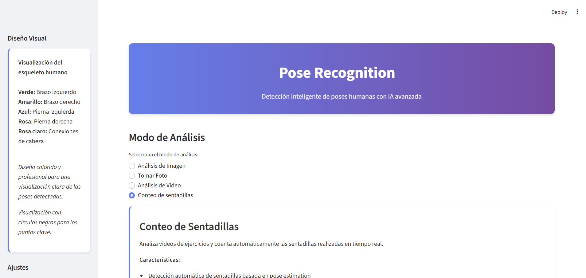
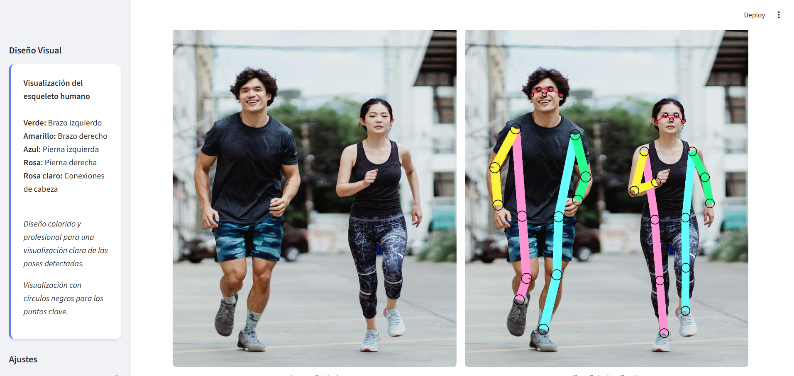
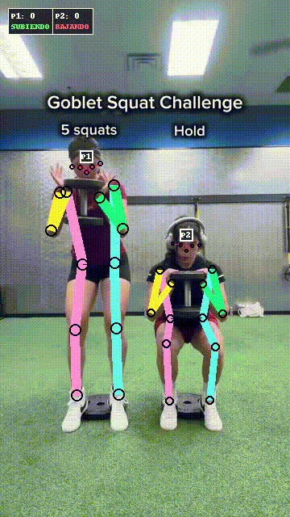

# PRTR Two-stage Cascade Transformers

## Información del Artículo Base

**Nombre del artículo:** Pose Recognition with Cascade Transformers

**Enlace al artículo:** [Pose Recognition with Cascade Transformers](https://openaccess.thecvf.com/content/CVPR2021/papers/Li_Pose_Recognition_With_Cascade_Transformers_CVPR_2021_paper.pdf)

**Repositorio original:** [PRTR en GitHub](https://github.com/mlpc-ucsd/PRTR/tree/main)

## Descripción 

Esta aplicación ofrece una interfaz web hecha con Streamlit para realizar detección de poses humanas en imágenes y videos utilizando el modelo PRTR (Pose Recognition with Cascade Transformers). Esta técnica detecta personas y estima sus 17 keypoints corporales mediante una arquitectura de Transformers en cascada, permitiendo identificar y analizar poses con alta precisión y eficiencia. A diferencia de los enfoques tradicionales basados en heatmaps, PRTR adopta un método de regresión directa que elimina la necesidad de complejos pre-procesamientos y post-procesamientos heurísticos.

Además de la detección de poses, la aplicación incluye una funcionalidad avanzada de **conteo automático de sentadillas** que analiza videos de ejercicios en tiempo real. Esta característica detecta automáticamente cuando una persona realiza una sentadilla completa basándose en el análisis de los keypoints corporales (caderas y rodillas), proporcionando un conteo preciso y visualización del estado del movimiento (BAJANDO/SUBIENDO) superpuesto en el video procesado.


## Interfaz

La aplicación ofrece una interfaz web intuitiva y moderna construida con Streamlit. A continuación se muestran capturas de pantalla de las diferentes secciones:

### Página de Inicio



La página de inicio presenta un diseño limpio y profesional con:
- **Header**: Título "Pose Recognition" 
- **Sidebar de configuración**: Panel lateral con opciones de diseño visual y ajustes de parámetros
- **Modos de análisis**: Selección entre diferentes modos (Análisis de Imagen, Tomar Foto, Análisis de Video, Conteo de sentadillas)
- **Descripción de características**: Información detallada sobre cada funcionalidad disponible

### Resultados de Detección



La sección de resultados muestra:
- **Comparación lado a lado**: Visualización de la imagen original junto con los resultados de detección
- **Opción de descarga**: Botón para descargar los resultados procesados


## Ejemplos

### Contador de Sentadillas

<div align="center">
  <table>
    <tr>
      <td align="center">
        
      </td>
      <td align="center">
        
      </td>
      <td align="center">
        
      </td>
    </tr>
  </table>
</div>

### Innovaciones principales:

**Arquitectura Two-Stage en Cascada:**
- **Person-Detection Transformer (DETR)**: Detecta personas en la imagen completa usando el mecanismo de matching bipartito de DETR. DETR usa matching bipartito que evita duplicados.
- **Keypoint-Detection Transformer (PRTR)**: Predice los 17 keypoints COCO para cada persona detectada mediante regresión directa de coordenadas, haciendo el pipeline completamente diferenciable.
- **Mecanismo de Queries**: 100 queries aprendidas que compiten para predecir los 17 keypoints, asignadas óptimamente mediante el algoritmo húngaro basado en probabilidad de clase.
- **Algoritmo Húngaro para Entrenamiento**: Durante el entrenamiento, el algoritmo húngaro asigna óptimamente las queries a los keypoints ground truth, permitiendo que el modelo aprenda a refinar progresivamente las predicciones a través de las capas del decoder. Este matching óptimo asegura que cada query se especialice en predecir un keypoint específico, facilitando el refinamiento iterativo de las predicciones.

## Resumen Teórico de la Arquitectura

### Arquitectura Two-Stage


La arquitectura two-stage de PRTR consiste en:

#### 1. Person-Detection Transformer (DETR)

- **Backbone CNN**: Extrae características de la imagen completa
- **Transformer Encoder-Decoder**: Procesa las características con atención
- **Salida**: Detecta personas con bounding boxes usando el mecanismo de matching bipartito de DETR
- **Filtrado**: DETR usa matching bipartito que evita duplicados, por lo que no requiere NMS. Se filtra por umbral de confianza (threshold) y se ordenan las detecciones por score descendente.

#### 2. Keypoint-Detection Transformer (PRTR)

- **Input**: Recortes de personas detectadas (expandidos 12.5% en cada dirección, 25% total para contexto adicional)
- **Procesamiento**: Cada recorte se procesa independientemente con transformación afín al tamaño del modelo (512x384 píxeles, height x width)
- **Mecanismo de Queries**: 100 queries aprendidas que compiten para predecir los 17 keypoints
- **Hungarian Matching**: Asigna óptimamente queries a keypoints usando el algoritmo de asignación lineal (linear_sum_assignment) basado en las probabilidades de clase. Este matching se realiza internamente en `get_final_preds_match()`.
- **Filtrado Posterior**: Después del Hungarian Matching, se aplican filtros adicionales para validar keypoints:
  - Probabilidad de clase > 30%
  - Distancia espacial < 50 píxeles
  - Confianza del heatmap > 80%
- **Salida**: maximo de  17 keypoints por persona

### Proceso de Inferencia

1. **Detección**: El Person-Detection Transformer identifica todas las personas en la imagen
2. **Recorte**: Cada detección se expande 12.5% en cada dirección (25% total) y se recorta
3. **Normalización**: Transformación afín al tamaño del modelo (512x384 píxeles, width x height) usando centro y escala calculados del recorte
4. **Predicción**: Keypoint-Detection Transformer procesa cada recorte
5. **Flip-Test**: Promedio de predicciones con imagen espejo para mayor robustez
6. **Transformación Inversa**: Coordenadas se mapean de vuelta al espacio original:
   - Espacio del modelo → Espacio del recorte (transformación afín inversa)
   - Espacio del recorte → Imagen original (aplicación de offsets de bounding box)

## Pasos para ejecutar el proyecto

### Prerrequisitos

- Docker y Docker Compose instalados
- CUDA (opcional, para aceleración GPU)
- 8GB+ RAM recomendado

### Estructura de Modelos

Asegurar la siguiente estructura de archivos en el directorio del proyecto:

```
models/
├── pytorch/
│   └── pose_coco/
│       └── pose_transformer_hrnet_w32_512x384.pth
└── detr-resnet-101/
    ├── config.json
    ├── model.safetensors
    └── preprocessor_config.json
```
Descargar en el siguiente link [link models](https://drive.google.com/drive/folders/1eJCNwf9BnJf0YoOLLk5rKQw7pdFtb33w?usp=sharing)

### 1) Despliegue con Docker

#### Construcción y Ejecución

```bash
# Construir imagen
docker compose build

# Ejecutar contenedor
docker compose up
```

#### Acceso a la Aplicación

- Abrir en el navegador: `http://localhost:8501`
- Para detener el servicio: `Ctrl + C`

### 2) Uso de la Aplicación Streamlit

#### Modo "Análisis de Imagen"
- Subir una imagen (formatos: JPG, JPEG, PNG, BMP)
- Ajustar parámetros en la barra lateral:
  - **Sensibilidad de detección**: Controla umbral de confianza DETR (0.9 recomendado)
  - **Tamaño de puntos**: Ajusta visualización de keypoints
  - **Grosor de líneas**: Controla grosor del esqueleto visible
- Presionar "Analizar Pose"

#### Modo "Tomar Foto"
- Permitir acceso a cámara
- Capturar foto
- Presionar "Analizar Pose"

#### Modo "Análisis de Video"
- Subir un video (formatos: MP4, AVI, MOV, MKV, WEBM)
- Configurar opciones de procesamiento:
  - **Frame skip**: Procesar cada N frames (1-10, recomendado: 2)
  - **Orientación**: Horizontal o Vertical
  - **Resolución**: 360p, 480p, 720p, 1080p u Original
  - **Límite de frames**: Opcional para videos largos
- Presionar "Procesar Video"
- Descargar video procesado con poses detectadas

#### Modo "Conteo de sentadillas"
- Subir un video con ejercicios de sentadillas
- Configurar opciones de procesamiento (similar a Análisis de Video)
- Presionar "Procesar Video"
- El sistema cuenta automáticamente las sentadillas realizadas
- Visualización en tiempo real del conteo y estado (BAJANDO/SUBIENDO)
- Descargar video procesado con conteo superpuesto

#### Resultados
- Comparación lado a lado: Imagen original vs Imagen con poses detectadas
- Métricas de detección: Número de personas detectadas
- Tiempo de inferencia: Tiempo de procesamiento
- Opción de descarga de resultados en formato PNG

## ¿Cómo se cargan los pesos?

La función `load_models()` en `app.py`:

1. **Modelo de Pose (PRTR)**:
   - Lee la configuración desde `experiments/coco/transformer/w32_512x384_adamw_lr1e-4.yaml`
   - Carga la arquitectura PRTR-HRNet W32
   - Inyecta los pesos preentrenados desde `models/pytorch/pose_coco/pose_transformer_hrnet_w32_512x384.pth`
   - Pone el modelo en modo evaluación (`eval()`)

2. **Modelo DETR (Detección)**:
   - Carga el procesador y modelo DETR desde la carpeta local `models/detr-resnet-101/`
   - Usa `DetrImageProcessor` para preprocesamiento
   - Usa `DetrForObjectDetection` para inferencia

3. **Dispositivo**:
   - Selecciona automáticamente `cuda` si está disponible, en caso contrario `cpu`

**Rutas importantes (por defecto en `app.py`)**:
- Pose: `models/pytorch/pose_coco/pose_transformer_hrnet_w32_512x384.pth`
- DETR: `models/detr-resnet-101/` (directorio con los ficheros del modelo)

**Nota**: Si cambias la ubicación de los modelos, ajusta en `app.py`:
- Ruta del pose: atributo `pretrained` de la clase `Args`
- Ruta del DETR: variable `local_model_path` dentro de `load_models()`

## ¿Cómo se realiza la inferencia?

### Pipeline de Inferencia

#### Fase 1: Detección de Personas

1. **Procesamiento DETR**:
   - Imagen completa → características extraídas
   - Post-procesamiento: filtrado por clase "persona" (label == 1 en COCO)
   - Umbral de confianza configurable (0.9 recomendado)
   - DETR usa matching bipartito que evita duplicados, por lo que no requiere NMS
   - Las detecciones se ordenan por score descendente

2. **Expansión de Bounding Boxes**:
   - Cada caja se expande 12.5% en cada dirección (25% total)
   - Proporciona contexto adicional para keypoints cerca de los bordes
   - Mejora la detección de extremidades

#### Fase 2: Estimación de Pose

1. **Transformación Afín**:
   - **Centro**: `(w/2, h/2)` del recorte
   - **Escala**: `max(w, h) / 200.0 * 1.25` (factor 1.25 para margen)
   - **Tamaño objetivo**: 512x384 píxeles (width x height)

2. **Inferencia del Modelo**:
   - **Forward pass original**: Recorte transformado → predicción
   - **Forward pass flipped**: Imagen espejo → predicción
   - **Promedio**: `(predicción_original + predicción_flipped) / 2.0`
   - Mayor robustez ante variaciones de orientación

3. **Hungarian Matching**:
   - Se ejecuta internamente en `get_final_preds_match()` usando `linear_sum_assignment`
   - 100 queries aprendidas compiten para predecir 17 keypoints
   - Asignación óptima basada en las probabilidades de clase (matriz de costos negativa)
   - El algoritmo encuentra la mejor asignación 1-a-1 entre queries y keypoints

4. **Filtrado Posterior**:
   - Después del Hungarian Matching, se aplican filtros adicionales para validar keypoints:
     - **Probabilidad de clase** > 30%
     - **Distancia espacial** < 50 píxeles
     - **Confianza del heatmap** > 80%
   - Keypoints con baja confianza se enmascaran como NaN

5. **Transformación Inversa**:
   - **Paso 1**: Coordenadas modelo → espacio recorte (transformación afín inversa)
   - **Paso 2**: Espacio recorte → imagen original (aplicación de offsets de bounding box)
   - Garantiza que los keypoints se dibujen en la posición correcta

#### Fase 3: Visualización

1. **Dibujado del Esqueleto**:
   - Conexión de pares de joints según definición COCO
   - Líneas coloridas por segmento corporal:
     - Verde: brazo izquierdo
     - Amarillo: brazo derecho
     - Azul: pierna izquierda
     - Rosa: pierna derecha
     - Rosa claro: conexiones de cabeza

2. **Métricas y Estadísticas**:
   - Número de personas detectadas
   - Tiempo de inferencia del procesamiento
   - Visualización de poses con keypoints y esqueleto dibujados

### Configuraciones Clave

#### Parámetros DETR
- **Umbral confianza**: 0.9 (balance precisión/recall)
- **Matching bipartito**: DETR evita duplicados automáticamente
- **Expansión bbox**: 12.5% en cada dirección (25% total) para mejor contexto de keypoints

#### Parámetros PRTR
- **Tamaño entrada**: 512x384 píxeles (width x height, óptimo para HRNet-W32)
- **Flip-test**: Habilitado (mejora robustez)
- **Umbral keypoints**: 0.8 (filtrado conservador)
- **Hungarian Matching**: Automático (basado en probabilidades de clase)
- **Filtrado posterior**: Probabilidad > 30%, distancia < 50px, confianza > 80%

## ¿Cómo funciona el conteo de sentadillas?

El sistema de conteo automático de sentadillas utiliza los keypoints detectados por el modelo PRTR para analizar el movimiento de la persona y contar las sentadillas completas realizadas.

### Algoritmo de Detección

El algoritmo se basa en el análisis de la posición relativa entre las **caderas** y las **rodillas** de la persona:

1. **Keypoints Utilizados**:
   - **Caderas**: Keypoints 11 (cadera izquierda) y 12 (cadera derecha) del formato COCO
   - **Rodillas**: Keypoints 13 (rodilla izquierda) y 14 (rodilla derecha) del formato COCO

2. **Cálculo de Posición**:
   - Se calcula el promedio de las coordenadas Y (vertical) de ambas caderas
   - Se calcula el promedio de las coordenadas Y de ambas rodillas
   - Se calcula la diferencia: `diff = hip_y_avg - knee_y_avg`
   - En el sistema de coordenadas, Y aumenta hacia abajo

3. **Detección de Estado**:
   - **Posición de pie (UP)**: Cuando la cadera está significativamente arriba de la rodilla (`diff < -50 píxeles`)
   - **Posición de sentadilla (DOWN)**: Cuando la cadera está cerca o por debajo de la rodilla (`diff > -50 píxeles`)

4. **Conteo de Sentadillas**:
   - El sistema mantiene un estado por persona (`'up'` o `'down'`)
   - Se detecta una **transición de arriba a abajo** cuando cambia de `'up'` a `'down'` (persona empieza a bajar)
   - Se detecta una **transición de abajo a arriba** cuando cambia de `'down'` a `'up'` (persona completa la sentadilla)
   - **Una sentadilla completa** se cuenta cuando se detecta la transición de `'down'` a `'up'`

### Procesamiento de Video

Para videos, el sistema:

1. **Procesa cada frame** (o cada N frames según el frame skip configurado)
2. **Detecta personas** usando DETR y estima sus keypoints con PRTR
3. **Mantiene estado independiente** para cada persona detectada
4. **Actualiza el conteo** en tiempo real según las transiciones detectadas
5. **Visualiza el resultado** superponiendo en el video:
   - Número total de sentadillas contadas
   - Estado actual: "BAJANDO" (rojo) o "SUBIENDO" (verde)

### Características del Algoritmo

- **Robustez**: Solo cuenta sentadillas cuando hay suficientes keypoints visibles (al menos una cadera y una rodilla)
- **Multi-persona**: Mantiene conteos independientes para cada persona en el video
- **Tolerancia**: Usa un umbral de 50 píxeles para evitar falsos positivos por pequeños movimientos
- **Visualización en tiempo real**: Muestra el conteo y estado durante el procesamiento del video

### Limitaciones

- Requiere que la persona esté completamente visible en el video
- Funciona mejor con vista lateral o frontal de la persona
- La precisión depende de la calidad de detección de keypoints (iluminación, fondo, etc.)
- Puede tener dificultades con movimientos muy rápidos si el frame skip es muy alto

## Agradecimientos
Este proyecto está basado en los siguientes repositorios de código abierto, que facilitan enormemente nuestra investigación.

- Gracias a [DETR](https://github.com/facebookresearch/detr) por la implementación de [Detection Transformer](https://arxiv.org/abs/2005.12872)

- Gracias a [PRTR](https://github.com/mlpc-ucsd/PRTR/tree/main) por la implementación de [Pose Recognition with Cascade Transformers](https://openaccess.thecvf.com/content/CVPR2021/papers/Li_Pose_Recognition_With_Cascade_Transformers_CVPR_2021_paper.pdf)


## Herramientas Utilizadas

- 🧰 **[Git](https://git-scm.com/)**
- 🗂 **[GitHub](https://github.com/)**
- 🐍 **[Python](https://www.python.org/)**
- 🔥 **[Pytorch](https://pytorch.org/)**
- 🐳 **[Docker](https://www.docker.com/)**
- 📈 **[Streamlit](https://streamlit.io/)**
- 🧬 **[Hugging Face Transformers](https://huggingface.co/docs/transformers)**

## Autores

- **Jhonatan Steven Morales / jhonatan19991**  
- **Manuel Alejandro Perlaza / manuel-gruezo**  
- **Carol Dayana Varela / caroldvarela**  